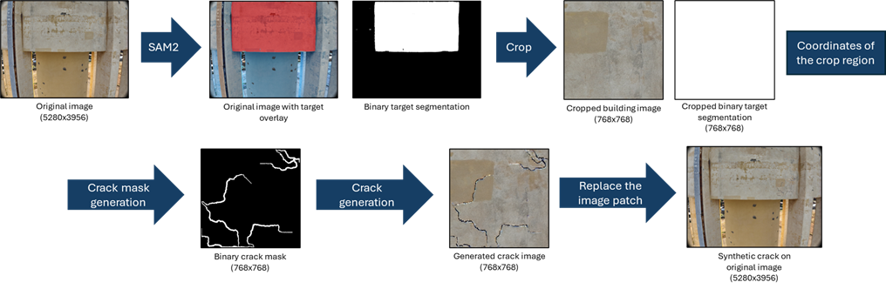

# Synthetic Crack Generator With ControlNet Guided Stable Diffusion

Synthetic crack generation system first use SAM2 object segmentation to identify the target region for crack generation.  A 768x768 patch is cropped from the target region to generation binary crack mask. The binary crack mask and the cropped building images will be input to a controlnet guided stable diffusion model to generate syntheic crack on building walls.

# 1. Installation Guide
## install the required library, run
"pip install -r requirements.txt"

## install SAM2, run
"git clone https://github.com/facebookresearch/sam2.git && cd sam2"
"pip install -e ."

## Download the SAM2 Models, run
"cd checkpoints && \
./download_ckpts.sh && \
cd .."

## Copy sam2_segmentation.py into the folder "sam2", run
"cp sam2_segmentation.py  sam2/sam2_segmentation.py"

# 2. Script Description
## 2.1 sam2_segmentation.py
sam2_segmentation.py needs to be placed in the 'sam2' folder. It is used to identify the target region for crack generation. It takes the original image as input and ask user to click on the interest region with mouse and output the overlay and binary mask of the target region. 

### argv for sam2_segmentation.py
required:
  'image_path" : path to the image to be segmented 
optional:
  '--model': 'SAM2 model to use (default: facebook/sam2-hiera-large)' 
  '--overlay-dir': 'Directory for overlay output (default: target_overlay)'
  '--mask-dir': 'Directory for binary mask output (default: target_binary_mask)'

### running the script
python sam2_segmentation.py 'image_path' --'optional argv' value

## 2.2 crop.py
cropping a smaller patch from the segmented area of the binary mask and original image. 

### argv for crop.py
required:
  'image': 'Path to input image'
  "mask": 'Path to binary mask'
optional:
  "--out_dir": 'Output directory (default: current directory)'
  "--crop_size": 'Size of the squared crop patch (default: 768)'

### running the script
python crop.py 'image' 'mask' --'optional argv' value

## 2.3 crack_mask_generator.py
generating random binary crack mask based on the input cropped target region mask

### argv for crack_mask_generator.py
required:
  'input': 'Path to input cropped target region binary mask'
optional:
  "--num_cracks": 'number of crack seeds (default: 3)'
  "--min_length": 'minimum length of the crack (default: 300)'
  "--max_length": 'maximum length of the crack (default: 500)'
  "--branch_prob": 'branching probability of the crack (default: 0.3)'
  "--thickness_scale": 'thickness scale of the crack (default: 1.0)'

### running the script
python crack_mask_generator.py 'input' --'optional argv' value

## 2.4 crack_generator.py
use controlnet to guide the stable diffusion to generate crack following the binary crack mask on the input image

### argv for crack_generator.py
required:
  'image_path': 'Path to the original image'
  'mask_path': 'Path to the mask image'
optional:
  "--output_path": "Path to save output (default: original_image_with_cracks.png)"
  "--seed": "Random seed for reproducibility (default: 1)"
  "--guidance_scale": "Guidance scale for prompt adherence (default: 70)"
  "--controlnet_scale": "ControlNet conditioning scale (default: 2.5)" 
  "--inference_steps": "Number of inference steps (default: 200)"

### running the script
python crack_generator.py 'image_path' 'mask_path' --'optional argv' value

## 2.5 gen_crack_mask.sh
bash code for automatic crack mask generation

## 2.6 gen_crack_image.sh
bash code for automatic crack image generation

## 2.7 replace.py
replacing the patch from the original image with the generated image

### argv for replace.py
required:
  'original': 'Path to the original image'
  'patch': 'Path to patch image to insert'
  'coords': 'Path the JSON file with the crop coordinates'
optional:
  "--output": "Path to save the modified image (default: same directory as original image with _modified suffix)"

### running the script
python replace.py 'original' 'patch' 'coords' --'optional argv' value

